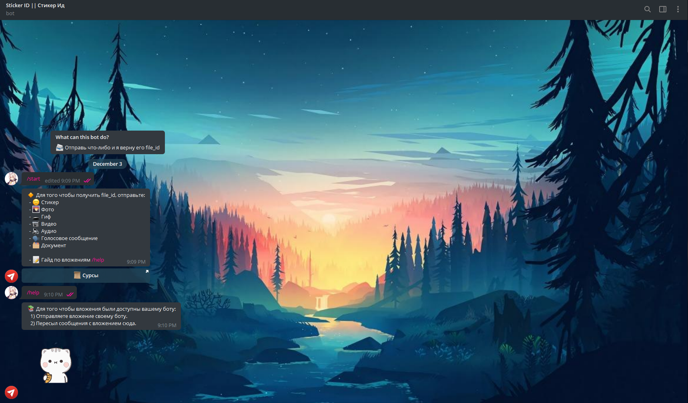

# How get sticker ID in telegram?

##### Use my [bot](https://t.me/idsticker_bot) OR run your bot via Node.JS


### Create bot
\# | Act
---|---
**1** | Create bot in [@BotFather](https://t.me/botFather)
**2** | Get and copy a bot token

### Cloning a repository and launching a bot
#### Cloning repo
\# | Command 
---|---------
**1** |```git clone https://github.com/leystof/idstickerbot_telegram```
**2** |```cd idstickerbot_telegram```
**3** |```npm i```
#### Change a bot token
\# | Act
---|----
**1** |Open index.js
**2** | insert a bot token into "token" variable
**3** | Save file
#### Bot Launch
Start this command in folder with bot
```node index.js```


